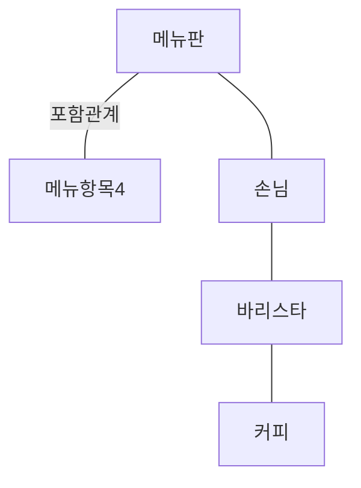

# 📌 Contents

**개념 관점) 설계**는 ****도메인 안에 존재하는 개념과 개념들 사이의 관계를 표현한다.

도메인: 사용자들이 관심을 가지고 있는 특정 분야나 주제

→ 실제 도메인의 규칙과 제약을 최대한 유사하게 반영하는 것이 핵심

**명세 관점)** 

도메인의 개념이 아니라 객체들의 책임에 초점을 맞추게 된다.

즉, 객체가 협력을 위해 ‘무엇’을 할 수 있는가에 초점을 맞춘다.

인터페이스와 구현을 분리하는 것은 객체지향 설계에서 가장 기본적은 원칙이다.

**구현 관점)**

객체들이 책임을 수행하는 데 필요한 동작하는 코드를 작성하는 것에 초점.

따라서 객체의 책임을 ‘어떻게’ 수행할 것인가에 초점을 맞추며 인터페이스를 구현하는 데 필요한 속성과 메서드를 클래스에 추가한다.

<aside>
💡 이번 장에서는 명세 관점에 더해 개념 관점과 구현 관점을 함께 다룬다.

</aside>

**연관 관계:** 한 타입의 인스턴스가 다른 타입의 인스턴스를 포함하지는 않지만 서로 알고 있어야 할 경우

커피 전문점을 구성하는 타입들…

### 📌 설계하고 구현하기

**아메리카노를 주문하라**

메시지를 받음 (아메리카노를 주문하라) →

먼저 도메인 모델 안에 책임을 수행하기에 적절한 타입이 존재하는지 보기 →

메시지를 처리할 객체는 손님 타입의 인스턴스! →

손님 객체는 커피를 주문할 책임을 할당 받았다.

**메뉴 항목을 찾아라**

‘메뉴 이름’이라는 인자를 포함해 함께 전송한다. →

‘메뉴 항목’ 객체를 포함하는 ‘메뉴판’ 객체에게 할당 →

메뉴판이 메뉴 항목을 제공

**커피를 제조하라**

손님은 바리스타에게 커피 제조 요청 메시지와 함께 메시지 인자로 메뉴 항목을 전달→

반환값으로 커피를 받아야 한다.

**생성하라**

바리스타가 커피를 생산

각 객체들이 수신하는 메시지는 객체의 인터페이스를 구성한다.

<aside>
💡 중요한 것은 설계가 아니라 그 코드다. 따라서 협력을 구상하는 단계에 너무 오랜 시간을 쏟지 말고 최대한 빨리 코드를 구현해서 설계에 이상이 없는지, 설계가 구현 가능한지를 판단해야 한다.

</aside>

### 📌 코드와 세 가지 관점

**코드는 세 가지 관점을 모두 제공해야 한다.**

인터페이스를 수정하면 해당 객체와 협력하는 모든 객체에게 영향을 미침.

객체의 인터페이스는 수정하기 어렵다.

개념 관점)

소프트웨어 크랠스와 도메인 클래스 사이의 간격이 좁으면 좁을수록 기능을 변경하기 위해 뒤적거려야 하는 코드의 양도 점점 줄어든다.

명세 관점)

클래스의 인터페이스를 바라본다. 변화에 안정적인 인터페이스를 만들기 위해서는 인터페이스를 통해 구현과 관련된 세부 사항이 드러나지 않게 해야 한다.

구현 관점)

클래스의 내부 구현을 바라본다. 메시드의 구현과 속성의 변경은 원칙적으로 외부의 객체에게 영향을 미쳐서는 안 된다.

**도메인 개념을 참조하는 이유**

메시지를 수신할 객체를 선택하는 방법

도메인 개념 중에서 가장 적절한 것을 선택하는 것

도메인에 대한 지식을 기반으로 코드의 구조와 의미를 쉽게 유추할 수 있으므로 시스템의 유지보수성에 커다란 영향을 준다.

**인터페이스와 구현을 분리**

명세 관점은 클래스의 안정적인 측면을 드러내야 하고, 구현 관점은 클래스의 불안정한 측면을 드러내야 한다.

# ❓ Questions

### ❓ 구현 관점은 클래스의 불안정한 측면을 드러내야 한다. 에서 불안정한 측면이 뭐고 왜 드러내야 하지?

구현 관점은 코드다. 코드는 캡슐화 되어야 하니까 내부 정보는 드러내면 안된다. 불안정한 측면은 내부 정보를 예측할 수 없는 관련없는 정보인 걸까? 그렇다면 불안정한 측면을 드러내는 이유는 내부 정보를 예측할 수 없게 하기 위한 것 같다.

24.02.16 스터디 이후) 밖에 드러낸다기 보다 구현 관점은 불안정한 측면이 도드라진다는 뜻인 것 같다!
